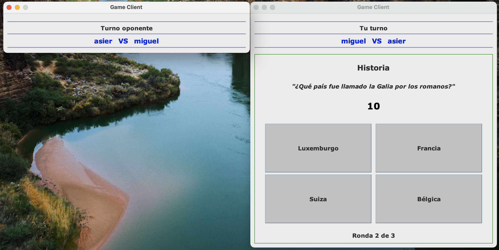

# Trivia Client-Server

A Java-based multiplayer trivia game where clients connect to a central server to compete in trivia matches. The project uses sockets for client-server communication, providing a real-time multiplayer experience. Features include user authentication, game session management, and encrypted communication.

## Features
- **Multiplayer Gameplay:** Supports multiple clients connecting to the server to play trivia against each other.
- **User Authentication:** Secure login and registration system to manage users.
- **Encrypted Communication:** Uses AES encryption to ensure secure data transmission between the client and server.
- **Game Management:** Dynamically handles game sessions, player turns, and scoring.

## Getting Started
1. Clone the repository.
2. Ensure you have a compatible JDK installed.
3. Build the project using Maven.
4. Run the server and connect clients to start playing.

## Screenshots

### Login and Registration

<table>
  <tr>
    <td></td>
    <td></td>
  </tr>
  <tr>
    <td align="center">Login Screen</td>
    <td align="center">Registration Screen</td>
  </tr>
</table>

### Gameplay

<table>
  <tr>
    <td></td>
    <td></td>
  </tr>
  <tr>
    <td align="center">Game Lobby</td>
    <td align="center">Question Screen</td>
  </tr>
  <tr>
    <td></td>
    <td></td>
  </tr>
  <tr>
    <td align="center">Opponent's Turn</td>
    <td align="center">Score Summary</td>
  </tr>
</table>
